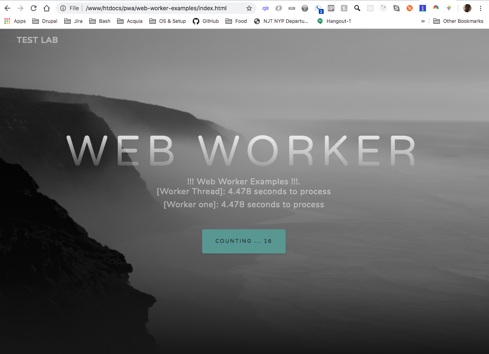

# Dynamic Web Worker Example
 Web Workers allow you to do things like firing up long-running scripts to handle computationally intensive tasks, but without blocking the UI. In fact, it all takes place in parallel . Web Workers are truly multi-threaded. [Learn more](https://blog.sessionstack.com/how-javascript-works-the-building-blocks-of-web-workers-5-cases-when-you-should-use-them-a547c0757f6a)




[](https://www.youtube.com/watch?v=wx4lQNGTf1s)


```
/**
 *  Helper function to dynamically create Web Workers.
 */
function createWorker(fn) {
  var blob = new Blob(["self.onmessage = ", fn.toString()], {
    type: "text/javascript"
  });
  var url = window.URL.createObjectURL(blob);
  return new Worker(url);
}

// Now simply process any function in background thread. 
// API call, CPU intensive operations, cache data in local storage etc..
if (window.Worker) {

  // WORKER 3
  var workerInstanceCache = createWorker(workerCacheURL);
  workerInstanceCache.postMessage("Helloooooo");


  // Worker 1
  var workerInstance = createWorker(dynamicWorker);
  workerInstance.postMessage("Helloooooo");

  workerInstance.onmessage = function (oEvent) {
    updateDOM(`[Worker Thread]: ${oEvent.data}`);
  };


  // Worker 1
  var workerSlowInstance = createWorker(dynamicWorker);
  workerSlowInstance.postMessage("Helloooooo");

  workerSlowInstance.onmessage = function (oEvent) {
    updateDOM(`[Worker one]: ${oEvent.data}`);
  };

}


```